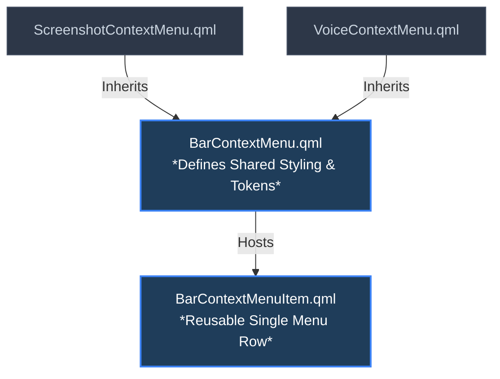

# Unified Bar Context Menu System

This document explains the architecture, design guidelines, and maintenance procedures for the unified bar context menus. Wi-Fi and Bluetooth no longer use bar context menus; their former actions live in their full management dialogs.

---

## 1. Overview & Architecture

We refactored the legacy boilerplate-heavy popup menus into a clean, reusable component hierarchy. This eliminates duplicate setup for shadows, borders, positioning, padding, and animations.



---

## 2. Component Reference

### Shared Container: [BarContextMenu.qml](file:///home/tetsuya/development/OMD/quickshell/modules/bar/BarContextMenu.qml)
Acts as the parent `PopupWindow`. It declares the visual shell, default layouts, shadows, fading animations, and centralized style tokens.

| Token | Type | Default Value | Description |
| :--- | :--- | :--- | :--- |
| `itemHeight` | `int` | `TuiStyle.rowHeight` | Vertical height of each clickable option row. |
| `itemRadius` | `int` | `5` | Rounded border radius of each menu item highlight. |
| `iconColumnWidth` | `int` | `26` | Width allocated for the icon placeholder layout. |
| `iconSize` | `int` | `18` | Rendered resolution of icons. |
| `itemSpacing` | `int` | `2` | Layout gap spacing between item buttons. |
| `hPadding` | `real` | `8` | Left and right internal paddings of options. |
| `menuPadding` | `real` | `6` | Boundary margins inside the background panel. |
| `outerPadding` | `real` | `8` | Border distance buffer for window clipping safety. |
| `separatorMargin` | `int` | `4` | Vertical spacing before and after separators. |

### Shared Row: [BarContextMenuItem.qml](file:///home/tetsuya/development/OMD/quickshell/modules/bar/BarContextMenuItem.qml)
Encapsulates individual row items based on a custom `RippleButton`, supporting generic labels, custom icons (`CosmicIcon`), hover states, and action triggers.

| Property | Type | Default | Description |
| :--- | :--- | :--- | :--- |
| `iconName` | `string` | `""` | Path to icon asset (e.g. `"devices/bluetooth-symbolic"`). |
| `iconColor` | `color` | `TuiStyle.fg` | Color of the icon element. |
| `labelColor` | `color` | `iconColor` | Font color. Falls back to `iconColor` if unspecified. |
| `label` | `string` | `""` | User-facing localized text (wrapped in `Translation.tr()`). |

### Removed Wi-Fi/Bluetooth Context Menus
Wi-Fi and Bluetooth bar icons now open their full dialogs directly on click. Their previous right-click actions moved into:

- Wi-Fi dialog: `IMPALA`, `EDITOR`, and `ENABLE` / `DISABLE`.
- Bluetooth dialog: `BLUETUI`, `BLUEMAN`, and `ENABLE` / `DISABLE`.

Do not reintroduce `WifiContextMenu.qml` or `BluetoothContextMenu.qml` unless the bar interaction model changes again.

---

## 3. Usage Examples

### Implementing a Basic Menu
This is the complete implementation required for a menu with custom items and standard separators.

```qml
pragma ComponentBehavior: Bound
import qs.services
import qs.modules.common
import qs.modules.common.widgets
import qs.modules.common.functions
import QtQuick
import QtQuick.Layouts
import Quickshell

BarContextMenu {
    id: root

    BarContextMenuItem {
        iconName:  "devices/bluetooth-symbolic"
        label:     Translation.tr("BlueTUI (TUI)")
        releaseAction: () => { Quickshell.execDetached(["my-tui-command"]); root.close() }
    }

    // Standard Horizontal Divider
    Rectangle {
        Layout.fillWidth:    true
        implicitHeight:      1
        color:               TuiStyle.line
        opacity:             TuiStyle.dividerOpacity
        Layout.topMargin:    root.separatorMargin
        Layout.bottomMargin: root.separatorMargin
    }

    BarContextMenuItem {
        iconName:  "actions/system-shutdown-symbolic"
        iconColor: TuiStyle.danger
        label:     Translation.tr("Turn Off")
        releaseAction: () => { root.close() }
    }
}
```

---

## 4. Maintenance & Customization

> [!TIP]
> **Changing the Global Menu Style:**  
> If you want to change padding, font weights, colors, heights, or spacing, edit them directly in [BarContextMenu.qml](file:///home/tetsuya/development/OMD/quickshell/modules/bar/BarContextMenu.qml). Every menu in the system inherits values dynamically from this single source of truth.

### Key Lifecycle Rules
1. **Focus/Click-away Handling:** The background system hooks into `GlobalFocusGrab` automatically. Clicking anywhere outside the menu boundaries triggers `close()`.
2. **Action Execution sequence:** When writing callback functions for `releaseAction`, **always close the menu (`root.close()`)** to return focus back to Hyprland or standard workspace layers.
