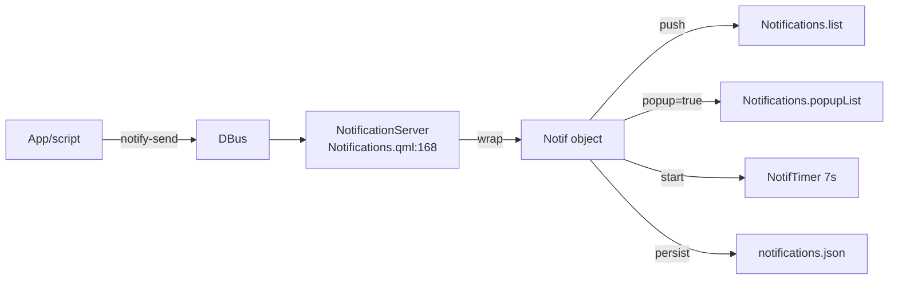

# Notification System

Date: 2026-07-19

## Overview

The notification system has three layers:

| Layer | Component | Path |
|---|---|---|
| **Server** | `Notifications.qml` (singleton) | `quickshell/services/Notifications.qml` |
| **Popup UI** | `NotificationPopup.qml` → `NotificationListView` → `NotificationGroup` → `NotificationItem` | `quickshell/modules/notificationPopup/` + `quickshell/modules/common/widgets/` |
| **History** | `TuiNotificationList.qml` | `quickshell/modules/schedulePopup/notifications/` |
| **Bar entry** | `ClockWidget.qml` | `quickshell/modules/bar/ClockWidget.qml` |

---

## 1. How Notifications Are Triggered

### Path A: External DBus (Desktop Notifications)

Any app or script calls `notify-send`, which arrives via DBus at `NotificationServer`:



Files calling `notify-send`:
- `Battery.qml` — low/critical/full battery
- `VoiceInput.qml` — setup progress
- `BarStatusPopup.qml` — session save
- `share/bin/omarchy-capture-screenshot` — screenshot taken
- `share/bin/omarchy-capture-text-extraction` — OCR done
- `quickshell/scripts/videos/record.sh` — recording start/stop
- `quickshell/scripts/colors/switchwall.sh` — wallpaper changed
- `apps/omd-clipboard/services/Cliphist.qml` — image path copied

### Path B: IPC (Cross-Process Control)

The bar process exposes an `IpcHandler` for notification control:

```javascript
// apps/omd-bar/shell.qml:76
IpcHandler {
    target: "notifications"
    function dismissLast(): void
    function dismissAll(): void
    function toggleSilent(): void
}
```

Usage: `qs -p $APP ipc call notifications dismissAll`

Note: external processes **cannot inject** new notifications via IPC — only DBus `notify-send`.

---

## 2. Core Service: `Notifications.qml`

| Lines | What |
|---|---|
| 19–43 | `Notif` component — wrapper around `Notification` |
| 62–74 | `NotifTimer` — auto-dismiss timer (default 7000ms) |
| 76–78 | `silent` (DND), `unread` counter, `filePath` |
| 80–81 | `popupList` — filtered list where `popup == true` |
| 96–107 | Debounced persistence (500ms) |
| 129–157 | Grouping by app name |
| 163–167 | Signals: `notify`, `discard`, `discardAll`, `timeout` |
| 168–205 | `NotificationServer` — DBus listener |
| 300–341 | Persistence: saves/loads `notifications.json` |

### Key design decisions:

- **Transient vs non-transient**: Transient notifications are fully removed on timeout; non-transient only lose their popup flag and stay in history
- **Timeout override**: If sender specifies `expireTimeout > 0`, it overrides the 7s default; if `expireTimeout == 0`, notification is persistent
- **DND**: When `silent` is true, `popupInhibited` prevents popup display but notifications are still persisted
- **Persistence**: JSON file at `~/.cache/quickshell/notifications/notifications.json`, debounced writes at 500ms

---

## 3. Popup Window: `NotificationPopup.qml`

| Property | Value |
|---|---|
| Position | Top-right overlay |
| Width | 410px (`Appearance.sizes.notificationPopupWidth`) |
| Layer | `WlrLayer.Overlay` |
| Exclusive zone | 0 (floating) |
| Visibility | `Notifications.popupList.length > 0 && !GlobalStates.screenLocked` |
| Screen | Configurable `forceMonitor` or focused monitor |
| Top margin | 4px (bar on bottom) or `barHeight + 8` (bar on top) |

### Popup behavior:

- **Visibility** is entirely reactive via QML bindings on `Notifications.popupList`
- **Hover** cancels auto-dismiss timer; un-hover re-triggers it
- **Drag-to-dismiss**: swipe left/right with 70px threshold, animated slide-out
- **Middle-click**: dismiss instantly
- **Critical** notifications: red left border, red shell border
- **Grouping**: notifications are grouped by `appName`; max 2 shown when collapsed, expandable via click

---

## 4. Visual Components

| Component | File | Role |
|---|---|---|
| `NotificationListView` | `common/widgets/NotificationListView.qml` | List model binding |
| `NotificationGroup` | `common/widgets/NotificationGroup.qml` | Group container, drag-dismiss, expand |
| `NotificationItem` | `common/widgets/NotificationItem.qml` | Individual notification card |
| `NotificationAppIcon` | `common/widgets/NotificationAppIcon.qml` | App icon / fallback |
| `NotificationActionButton` | `common/widgets/NotificationActionButton.qml` | Action pill button |
| `TuiNotificationList` | `schedulePopup/notifications/TuiNotificationList.qml` | History list in bar popup |

---

## 5. Bar Integration

1. **ClockWidget** (rightmost bar button): click toggles `GlobalStates.barPopupType` between `""` and `"notifications"`
2. **BarStatusPopup**: routes `activeType === "notifications"` to `notificationsContent` component
3. **Notifications popup content**: `PopupHeader` (bell + count) + DND toggle + Clear all + `TuiNotificationList`
4. **Mark read**: When bar popup opens, `markReadOnVisible` calls `Notifications.markAllRead()`

---

## 6. Configuration

In `quickshell/config.json`:

```json
{
  "notifications": {
    "silent": false,
    "timeout": 7000,
    "forceMonitor": {
      "enable": false,
      "name": ""
    }
  }
}
```

---

## 7. Key Files

| Path | Lines |
|---|---|
| `quickshell/services/Notifications.qml` | 342 |
| `quickshell/modules/notificationPopup/NotificationPopup.qml` | 49 |
| `quickshell/modules/common/widgets/NotificationListView.qml` | 26 |
| `quickshell/modules/common/widgets/NotificationGroup.qml` | 235 |
| `quickshell/modules/common/widgets/NotificationItem.qml` | 223 |
| `quickshell/modules/common/widgets/NotificationAppIcon.qml` | 92 |
| `quickshell/modules/common/widgets/NotificationActionButton.qml` | 49 |
| `quickshell/modules/common/functions/NotificationUtils.qml` | 111 |
| `quickshell/modules/schedulePopup/notifications/TuiNotificationList.qml` | 680 |
| `quickshell/modules/bar/BarStatusPopup.qml` | 2771 |
| `quickshell/modules/bar/ClockWidget.qml` | 57 |
| `quickshell/GlobalStates.qml` | — |
| `apps/omd-bar/shell.qml` | 120 |
